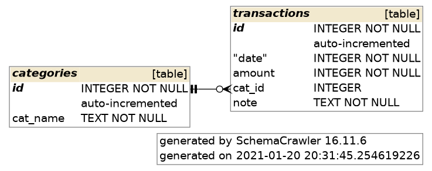

# CLI Expense Tracker

Simple CLI Expense Tracker written with C++.

*WORK IN PROGRESS*

## Dependencies

| lib          | usage                |
|--------------|----------------------|
| `sqlite_orm` | ORM                  |
| `Catch2`     | testing              |
| `libfort`    | pretty tables        |
| `CLI11`      | command line parsing |

## Build

`libsqlite3` is required!

```sh
mkdir build
cd build
cmake ..
make
```

## Database ER Diagram



## Examples

...
